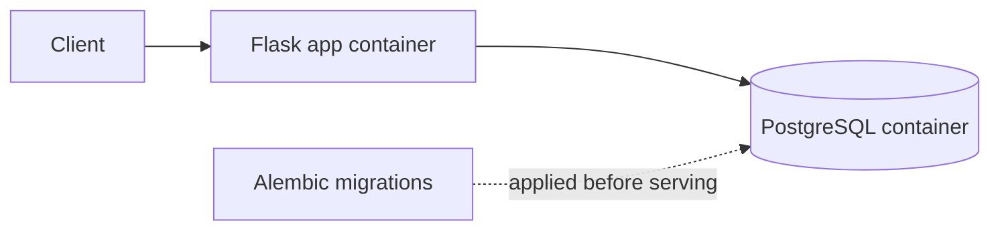

# webservice-template — opinionated Flask backend template

> Production-style layout for a small Flask + SQLAlchemy + PostgreSQL backend, with Alembic migrations, a rate-limiting layer, Docker Compose for local dev, and Kubernetes manifests that run on minikube without further config. The example domain is Formula 1, but the structure is reusable — fork it, swap the model layer, and you're shipping.

[](https://github.com/berekvolgyipeter/webservice-template/actions/workflows/test.yml)

## Why this exists

The first hour of every small backend project is the same: split the app and DB into containers, wire up Alembic, decide what `.env` looks like, plumb a rate limiter, write the Dockerfiles, write the Kubernetes manifests. This template skips that hour — fork it, swap the model layer, and you're past the boilerplate.

## What's opinionated

- **Layered structure.** `routes → schemas → interactors → database` is enforced by the folder layout, so HTTP concerns, validation, use cases, and persistence each have one place to live.
- **Migrations are first-class.** Alembic is wired against the app's `Base.metadata`, with a session-scoped pytest fixture that applies migrations before any test runs.
- **Rate limiting is built in.** Flask-Limiter is instantiated as a shared singleton in `app/global_objects.py` and applied per route — not bolted on later.
- **Local-dev = production topology.** Docker Compose and the Kubernetes manifests both run the app and Postgres as independent workloads talking by service name, so "works on compose" carries over to "works on the cluster".
- **Minikube works out of the box.** Manifests in `k8s-deployment/` apply cleanly against a fresh `minikube start`.

## Architecture



## Stack

- Flask, Flask-Limiter, Gunicorn
- PostgreSQL, SQLAlchemy, Alembic
- `schema` for request validation
- pytest for tests
- Docker, Docker Compose, Kubernetes (minikube)

## Layout

```
app/
  routes/        Flask blueprints (HTTP layer)
  schemas/       request validation and input DTOs
  interactors/   orchestration between routes and the database
  database/      SQLAlchemy models and query helpers
alembic/         migrations
k8s-deployment/  Kubernetes manifests
tests/           pytest suite, mirrors app/
```

## Dependencies

- [Docker](https://docs.docker.com/get-started/get-docker/)
- [Docker Compose](https://docs.docker.com/compose/install/)
- [Python 3.11](https://www.python.org/downloads/release/python-31111/)

## Quickstart

```sh
cp .env.example .env             # fill in the variables
pip install -r requirements.txt
make up                          # docker compose up -d
alembic upgrade head             # only required on a fresh database
```

The service is reachable at `http://localhost:8080`. See [`alembic/README.md`](alembic/README.md) for the migration workflow.

## Endpoints

| Method | Path       | Purpose                      |
|--------|------------|------------------------------|
| GET    | `/`        | Health check                 |
| GET    | `/drivers` | List drivers (filterable)    |
| POST   | `/drivers` | Create a driver              |
| GET    | `/results` | List grand prix results      |
| POST   | `/results` | Record a result for a driver |

## Testing

Tests run against a dedicated database container:

```sh
pip install -r requirements_test.txt
make up-test-db                  # docker compose -f docker-compose-test.yaml up -d
pytest
```

Alembic migrations are applied automatically by a session-scoped pytest fixture, so no manual setup is required between runs.

## Kubernetes deployment

Manifests live in `k8s-deployment/` and target a local single-node cluster (minikube). The corresponding Make targets are shown in parentheses.

1. Start the cluster (`make minikube-start`).
2. Apply the Postgres ConfigMap and Secret (`make deploy-postgres-config`, `make deploy-postgres-secret`).
3. Deploy Postgres (`make deploy-postgres`).
4. Apply the app ConfigMap and deploy the app (`make deploy-app-config`, `make deploy-app`).
5. Resolve the app's URL (`make minikube-app-url`).

The topology is intentionally minimal: a single-replica app Deployment and a single-replica Postgres Deployment (not a StatefulSet) backed by its own PersistentVolume inside the cluster. Suitable for local exercises, not for production.

## Example domain

The template ships with a small Formula 1 model layer (drivers and grand prix results) as a working example. Swap `app/database/` and the matching schemas/interactors for your own domain and the structure carries.

## License

[MIT](LICENSE)
